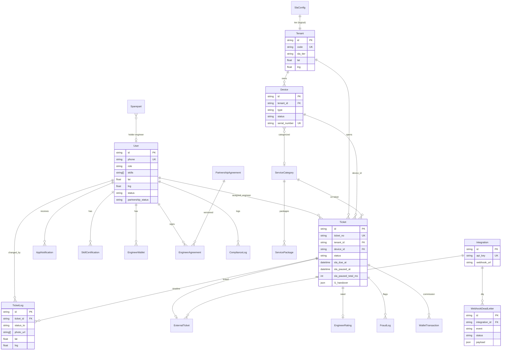

# FE-Track — Entity Relationship Diagram (ERD)

Sumber kebenaran: `prisma/schema.prisma`. Diagram di bawah merangkum entitas utama & relasi.

---

## 1. Diagram inti (Mermaid)



---

## 2. Domain groups

### 2.1 Identity & mitra
| Model | Keterangan |
|-------|------------|
| `User` | Admin, NOC L0/L1, Dispatcher, Field Engineer |
| `SkillCertification` | Sertifikasi skill (aktif + expiry) |
| `PartnershipAgreement` | Template perjanjian versi |
| `EngineerAgreement` | Tanda tangan per engineer |
| `ComplianceLog` | Audit compliance (timeout, reject, dll.) |

### 2.2 Asset & lokasi
| Model | Keterangan |
|-------|------------|
| `Tenant` | Toko / site + SLA tier + koordinat |
| `Device` | EDC / Router / Switch + status UP/DOWN |
| `Sparepart` | Stok gudang / dipegang engineer |
| `SlaConfig` | Response & resolution time per tier |

### 2.3 Ticketing & SLA
| Model | Keterangan |
|-------|------------|
| `Ticket` | Inti operasional; stop-clock; L1 handover JSON |
| `TicketLog` | Audit trail status + foto + GPS |
| `ServiceCategory` / `ServicePackage` | Kategori layanan & paket harga |
| `AppNotification` | Bell in-app |

### 2.4 Integrasi
| Model | Keterangan |
|-------|------------|
| `Integration` | Customer ITSM + API key + webhook |
| `ExternalTicket` | Mapping ID eksternal ↔ internal |
| `WebhookDeadLetter` | DLQ outbound gagal |

### 2.5 Komisi, fraud, talent
| Model | Keterangan |
|-------|------------|
| `CommissionRule`, `EngineerWallet`, `WalletTransaction`, `Withdrawal` | Fee & payout |
| `EngineerRating`, `FraudLog` | Anti-fraud & rating |
| `LeaderboardSnapshot` | Ranking periodik |
| `EngineerCandidate` | Pipeline recruitment |
| `KnowledgeBase` | SOP / artikel |

---

## 3. Enum status ticket (urutan bisnis)

```
OPEN → ASSIGNED → ON_THE_WAY → ON_SITE → IN_PROGRESS
  → PENDING_SPAREPART | PENDING_L1 | ESCALATED | PENDING_REVIEW
  → RESOLVED → CLOSED
```

Field SLA khusus pada `Ticket`:
- `sla_due_at` — target resolve
- `sla_paused_at` / `sla_paused_total_ms` / `stop_clock_reason` — stop clock
- `l1_handover` — JSON handover L0→L1
- `escalated_to_l1_at` / `escalated_by_id`

---

## 4. Relasi kritis (ringkas)

```
Tenant 1──* Device
Tenant 1──* Ticket
Device 0..1──* Ticket
User (FE) 0..1──* Ticket (assigned)
Ticket 1──* TicketLog
Ticket 0..1──1 ExternalTicket
Integration 1──* ExternalTicket
Integration 1──* WebhookDeadLetter
User 1──* AppNotification
User 1──* SkillCertification
```

---

## 5. Cara generate diagram visual

1. Buka file ini di GitHub / VS Code (Mermaid preview).
2. Atau: https://mermaid.live — paste blok `erDiagram`.
3. Schema lengkap: `npx prisma format` lalu baca `prisma/schema.prisma`.

Untuk ERD otomatis dari DB:

```bash
# opsional — butuh tool tambahan
npx prisma db pull
# atau gunakan pgAdmin / DBeaver ERD dari Postgres :5433
```
